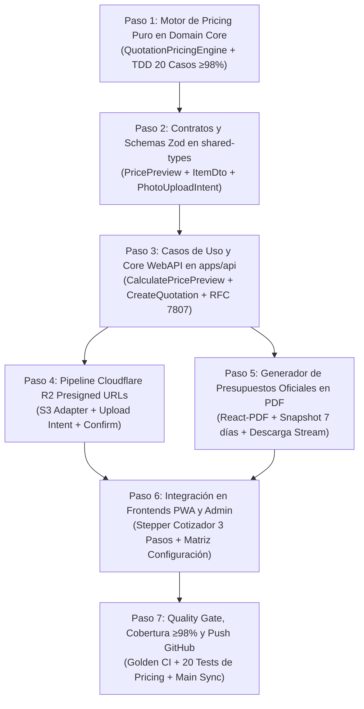

# 📐 Plan de Implementación Quirúrgica: Fase 2 — Motor de Cotización Algorítmica

> **Organización:** [ALR COMPANY](https://github.com/ALR1730) — División de Ingeniería de Software  
> **Líder de Proyecto & Founder:** [Angel Luis Rosario](https://github.com/ALR1730)  
> **Mentor Académico:** Ing. Leonardo (Base Formativa C#, .NET 9, Clean Architecture)  
> **Versión:** 2.0.0 — Edición "Turing-Grade"  
> **Estándar:** Clean Architecture · Domain-Driven Design (DDD) · TDD (≥98% Cobertura) · Dual-Stack Architecture

---

## 🎯 Objetivo de la Fase 2

Implementar con precisión matemática y arquitectónica el **núcleo de cotización de MITEFREE**:

1. Construir el **Motor de Cotización Algorítmica (`QuotationPricingEngine`)** en el dominio puro, con cálculo determinista centavo a centavo por ítem, factor de tela, recargo por severidad de manchas, descuentos no acumulables y canje de cashback.
2. Establecer el **Pipeline Multimedia Cloudflare R2** para la subida directa de fotos de manchas mediante Presigned URLs con TTL ≤ 15 minutos (0 egress fees).
3. Desarrollar el **Generador de Presupuestos en PDF** (`@react-pdf/renderer`), produciendo documentos oficiales con validez de 7 días y snapshot inmutable de precios.
4. Integrar el flujo punta a punta en el cliente **PWA (`apps/pwa-client/cotizar`)** y la consola de gestión de precios en **Admin Portal (`apps/admin-portal/configuracion`)**.
5. Cumplir con la meta de cobertura de pruebas unitarias: **≥ 98% en el motor de pricing** mediante TDD estricto.

---

## 🗺️ Matriz de Ejecución de la Fase 2



---

## 📋 Detalle Quirúrgico de Cada Paso

### 🔹 Paso 1: Motor Algorítmico Puro en Domain Core (`QuotationPricingEngine`)

- **Capa:** `packages/domain-core` (Núcleo Sagrado — Cero dependencias externas).
- **Responsabilidad:** Computar el valor exacto de cualquier combinación de servicio con precisión de tipo `Money`.
- **Fórmulas de Negocio Inmutables:**
  ```text
  Para cada QuotationItem:
    line_total = (furniture_base_price × fabric_factor) + stain_surcharge + additional_services_total

  Para la Cotización Global:
    subtotal        = Σ(line_total de todos los ítems)
    discount_amount = max(route_discount, coupon_discount)   ← No acumulables (política antifraude)
    wallet_credit   = min(wallet_balance_disponible, subtotal - discount_amount)
    total           = subtotal - discount_amount - wallet_credit
  ```
- **Catálogo de Factores y Recargos:**
  - **Telas (`FabricType`):** `SYNTHETIC` (1.00), `MICROFIBER` (1.15), `LINEN` (1.20), `VELVET` (1.40), `LEATHER` (1.50).
  - **Severidad de Mancha (`StainSeverity`):** `LIGHT` ($0), `MODERATE` ($15), `CRITICAL` ($35).
- **Archivos a crear/modificar:**
  - `packages/domain-core/src/engines/quotation-pricing.engine.ts`
  - `packages/domain-core/src/entities/quotation-item.entity.ts`
  - `packages/domain-core/src/index.ts` (exportar motor y entidades)
- **TDD Riguroso (`packages/domain-core/test/quotation-pricing.engine.spec.ts`):**
  - Mínimo 20 casos de prueba cubriendo combinatoria completa de telas, severidades, descuentos de ruta vs cupón y límites de cashback. Cobertura objetivo: **≥ 98%**.
- **Equivalencia .NET:** `Mitefree.Core.Domain.Services.QuotationPricingEngine` (Domain Service puro en C#).

---

### 🔹 Paso 2: Contratos de Transferencia y Schemas Zod (`packages/shared-types`)

- **Capa:** `packages/shared-types` (Contratos de frontera).
- **Responsabilidad:** Validar entradas del cliente antes de tocar la lógica de negocio y garantizar sincronía entre NestJS y Next.js.
- **Schemas a implementar:**
  - `PricePreviewRequestSchema` & `PricePreviewResponseSchema` (Cálculo instantáneo reactivo en UI sin persistencia).
  - `QuotationItemDetailSchema` (Detalle de cada mueble, tela seleccionada, severidad y fotos adjuntas).
  - `CreateQuotationFullSchema` (Creación formal con datos de contacto, dirección y snapshot de cálculo).
  - `PhotoUploadIntentSchema` (`filename`, `mimeType: image/jpeg | image/png | image/webp`, `sizeBytes <= 5MB`).
  - `PhotoConfirmSchema` (`fileKey`, `quotationItemId`).
- **Archivos a crear/modificar:**
  - `packages/shared-types/src/dtos/pricing-preview.dto.ts`
  - `packages/shared-types/src/dtos/quotation-photo.dto.ts`
  - `packages/shared-types/src/index.ts`
- **Equivalencia .NET:** DTOs con `FluentValidation` (`AbstractValidator<CreateQuotationRequest>`).

---

### 🔹 Paso 3: Casos de Uso y Endpoints en Core WebAPI (`apps/api`)

- **Capa:** `apps/api/src/application` y `apps/api/src/presentation`.
- **Casos de Uso (CQRS):**
  - `CalculatePricePreviewUseCase`: Query que ejecuta el `QuotationPricingEngine` en memoria y retorna el desglose detallado (línea por línea, subtotal, descuentos, anticipo requerido del 30%).
  - `CreateQuotationUseCase`: Command que valida las reglas de negocio, persiste la cotización en PostgreSQL mediante Drizzle ORM y asigna la fecha de expiración congelada a 7 días (`created_at + 7 days`).
  - `GetQuotationByIdUseCase`: Query que recupera la cotización completa con sus ítems y fotos vinculadas.
- **Controlador REST:**
  - `POST /api/v1/quotations/preview`: Endpoint público para cotización dinámica reactiva.
  - `POST /api/v1/quotations`: Creación de presupuesto formal congelado.
  - `GET /api/v1/quotations/:id`: Obtención detallada con desglose oficial.
- **Documentación:** OpenAPI Swagger y Scalar API Reference actualizado en `/api/docs`.
- **Equivalencia .NET:** MediatR Queries & Commands (`CalculatePricePreviewQuery`, `CreateQuotationCommand`).

---

### 🔹 Paso 4: Pipeline de Almacenamiento Multimedia Cloudflare R2 (`apps/api`)

- **Capa:** `apps/api/src/infrastructure/storage`.
- **Responsabilidad:** Permitir que los clientes suban fotos pesadas de manchas de manera segura sin saturar la memoria del servidor de la API ni generar costos de transferencia ($0 egress fees).
- **Flujo de Seguridad (Zero-Trust):**
  1. Cliente solicita subida: `POST /api/v1/quotations/photos/upload-intent`.
  2. El servidor valida tamaño (máx 5MB) y MIME (`image/webp`, `image/jpeg`, `image/png`).
  3. El servidor genera un `fileKey` aleatorio UUIDv4 (`evidence/{quotationId}/{itemId}-{uuid}.webp`) y una Presigned PUT URL firmada con AWS S3 SDK (TTL 15 minutos).
  4. Cliente sube el binario directamente a Cloudflare R2 vía `PUT`.
  5. Cliente confirma: `POST /api/v1/quotations/photos/confirm`, el servidor verifica la existencia del objeto y lo asocia en la tabla `quotation_photos`.
- **Archivos a crear/modificar:**
  - `apps/api/src/infrastructure/storage/r2-storage.adapter.ts`
  - `apps/api/src/application/quotations/upload-photo-intent.use-case.ts`
  - `apps/api/src/application/quotations/confirm-photo.use-case.ts`
  - `apps/api/src/presentation/controllers/quotations.controller.ts`

---

### 🔹 Paso 5: Generador de Presupuestos Oficiales en PDF

- **Capa:** `apps/api/src/infrastructure/pdf` y `apps/api/src/application/quotations`.
- **Tecnología:** `@react-pdf/renderer` para renderizado declarativo de alta fidelidad tipográfica.
- **Elementos del Presupuesto Oficial:**
  - Encabezado con branding corporativo **MITEFREE · ALR COMPANY**.
  - Código único de cotización: `COT-YYYY-XXXX` con código de barras / QR de verificación.
  - Datos del cliente, zona geoespacial y fecha de emisión.
  - Tabla de desglose de ítems: mueble, tipo de tela, severidad de mancha, precio base, recargos y total.
  - Resumen financiero: Subtotal, Descuento aplicado, Anticipo de reserva requerido (30%), Saldo de liquidación restante (70%).
  - Cláusula de validez: **"Precio congelado por 7 días calendario a partir de su emisión."**
  - Términos de garantía de servicio y desinfección profunda.
- **Endpoint:** `GET /api/v1/quotations/:id/pdf` con header `Content-Type: application/pdf` para descarga o vista previa en navegador.
- **Equivalencia .NET:** `QuestPDF` en ASP.NET Core MVC / Web API.

---

### 🔹 Paso 6: Integración Full-Stack en Frontends PWA y Admin

- **Cliente Móvil (`apps/pwa-client/src/app/cotizar`):**
  - Convertir el cotizador en un **Stepper Interactivo de 3 Pasos** ultra fluido:
    - **Paso 1 (Muebles y Telas):** Selección visual de tipos de mueble (Sofá 2/3 plazas, Sillón, Silla de comedor, Colchón) con chips de tela (`SYNTHETIC`, `LINEN`, `VELVET`, `LEATHER`, `MICROFIBER`).
    - **Paso 2 (Severidad y Diagnóstico):** Selector de manchas (`LIGHT`, `MODERATE`, `CRITICAL`) con módulo de cámara/subida de evidencia fotográfica directa con previsualización.
    - **Paso 3 (Presupuesto y Acciones):** Cálculo en tiempo real llamando a `/api/v1/quotations/preview`, desglose transparente de anticipo, botón para descargar PDF oficial y CTA para avanzar a `/agenda`.
- **Panel Administrativo (`apps/admin-portal/src/app/configuracion`):**
  - Conectar la pantalla de configuración para consultar y actualizar la matriz de precios base, factores de tela y multiplicadores de severidad almacenados en el esquema `catalog`.

---

### 🔹 Paso 7: Suite de Pruebas, Quality Gate y Push a GitHub

1. **Pruebas Unitarias TDD en Vitest:**
   - 20 casos exhaustivos en `quotation-pricing.engine.spec.ts`.
   - Cobertura verificada `≥ 98%` en el motor de cotización.
   - Tests de los nuevos use-cases en `apps/api`.
2. **Ejecución del Golden Pipeline Local:**
   ```bash
   bun run lint
   bun run type-check
   bun run test
   bun run build
   ```
3. **Commit y Push a GitHub:**
   ```bash
   git add .
   git commit -m "feat(pricing): implement QuotationPricingEngine with TDD, R2 photo upload and PDF generator"
   git push origin main
   ```

---

## ⏱️ Estimación de Ejecución Quirúrgica

| Hito         | Alcance                                                               | Duración Estimada  |
| :----------- | :-------------------------------------------------------------------- | :----------------: |
| **Hito 2.1** | Motor `QuotationPricingEngine` en Domain Core + 20 Tests TDD (≥98%)   |    ~20 minutos     |
| **Hito 2.2** | Schemas Zod en `shared-types` + UseCases de cálculo y creación en API |    ~20 minutos     |
| **Hito 2.3** | Pipeline Cloudflare R2 Presigned URLs + Stubs verificados             |    ~15 minutos     |
| **Hito 2.4** | Generador de PDF oficial con `@react-pdf/renderer` + Endpoint Stream  |    ~20 minutos     |
| **Hito 2.5** | Integración visual en PWA `/cotizar` y Admin `/configuracion`         |    ~25 minutos     |
| **Hito 2.6** | Golden CI Pipeline (Lint + TypeCheck + Vitest + Build) + Push GitHub  |    ~10 minutos     |
| **Total**    | **Fase 2 completa con calidad Turing-Grade**                          | **~1 hora 50 min** |
