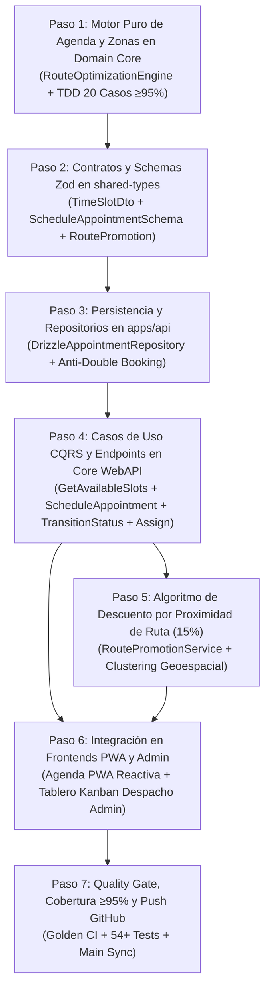

# 📐 Plan de Implementación Quirúrgica: Fase 3 — Motor de Agenda & Logística por Zonas

> **Organización:** [ALR COMPANY](https://github.com/ALR1730) — División de Ingeniería de Software  
> **Líder de Proyecto & Founder:** [Angel Luis Rosario](https://github.com/ALR1730)  
> **Mentor Académico:** Ing. Leonardo (Base Formativa C#, .NET 9, Clean Architecture, Onion Architecture)  
> **Versión:** 3.0.0 — Edición "Turing-Grade"  
> **Estándar:** Clean Architecture · Domain-Driven Design (DDD) · TDD (≥95% Cobertura) · Dual-Stack Architecture

---

## 🎯 Objetivo de la Fase 3

Construir la infraestructura algorítmica de **gestión de citas, asignación geoespacial de técnicos y optimización de rutas de MITEFREE**:

1. Desarrollar el **Motor de Optimización de Rutas y Agenda (`RouteOptimizationEngine`)** en el dominio puro (`packages/domain-core`), resolviendo asignaciones por cuadrante geoespacial, capacidad de flota y detección automática de descuentos de ruta (15% Route Discount) para clustering eficiente de servicios.
2. Blindar la regla de negocio **Anti-Double Booking** tanto a nivel de dominio puro (invariantes de agregados) como a nivel de persistencia relacional (índices únicos en Drizzle / PostgreSQL).
3. Establecer el ciclo de vida inmutable de la cita mediante **Domain Transitions** tipadas: `PendingPayment → Confirmed → EnRoute → InProgress → Completed / Cancelled`.
4. Exponer endpoints REST en `apps/api` con validación Zod en `packages/shared-types` y contratos OpenAPI Swagger / Scalar en `/api/docs`.
5. Conectar la experiencia del cliente móvil en **PWA (`apps/pwa-client/agenda`)** con cálculo dinámico de bloques disponibles y bonificación de ruta, y el panel operativo en **Admin Portal (`apps/admin-portal/citas`)** con tablero Kanban interactivo de despacho de cuadrillas.
6. Cumplir con la meta de cobertura de pruebas unitarias: **≥ 95%** en el motor de agenda y logística mediante TDD estricto.

---

## 🗺️ Matriz de Ejecución de la Fase 3

---

## 📋 Detalle Quirúrgico de Cada Paso

### 🔹 Paso 1: Motor Algorítmico Puro en Domain Core (`RouteOptimizationEngine`)

- **Capa:** `packages/domain-core` (Núcleo Puro — Cero dependencias externas).
- **Zonas Canónicas:**
  - `ZONE-DN`: Distrito Nacional (Piantini, Naco, Bella Vista, Gazcue).
  - `ZONE-SDE`: Santo Domingo Este (Alma Rosa, Ensanche Ozama, San Isidro).
  - `ZONE-SDO`: Santo Domingo Oeste (Herrera, Alameda, Los Ríos).
  - `ZONE-SDN`: Santo Domingo Norte (Villa Mella, Mirador Norte).
  - `ZONE-C`: Cuadrante Central general.
- **Bloques Horarios Canónicos (`TimeSlotCode`):**
  - `MORNING`: 08:30 – 11:30 (3 horas).
  - `AFTERNOON`: 13:00 – 16:00 (3 horas).
  - `EVENING`: 16:30 – 19:30 (3 horas).
- **Reglas de Negocio Inmutables:**
  1. Un técnico no puede tener dos citas en el mismo bloque horario y fecha.
  2. Si un técnico ya tiene una cita confirmada en la Zona X en la fecha D, los time-slots contiguos en la misma zona activan un **15% de Descuento de Ruta (`ROUTE_PROMOTION_RATE = 0.15`)**.
  3. La distancia geoespacial entre dos puntos de servicio de la misma cuadrilla no debe superar el umbral máximo de eficiencia operativa (`MAX_COMMUTE_KM = 25km`).
- **TDD Riguroso:** Mínimo 20 casos de prueba en `packages/domain-core/test/route-optimization.engine.spec.ts`.

---

### 🔹 Paso 2: Contratos de Transferencia y Schemas Zod (`packages/shared-types`)

- **Archivos:** `packages/shared-types/src/dtos/appointment-schedule.dto.ts`.
- **Schemas:**
  - `TimeSlotAvailabilitySchema`: id, code, startTime, endTime, zoneCode, isAvailable, hasRoutePromotion.
  - `ScheduleAppointmentRequestSchema`: quotationId, clientId, timeSlotId, scheduledDate, zoneCode, address, clientNotes.
  - `TransitionAppointmentStatusSchema`: appointmentId, nextStatus.
  - `AssignTechnicianSchema`: appointmentId, technicianId.
  - `RoutePromotionQuerySchema`: zoneCode, date.

---

### 🔹 Paso 3: Persistencia y Repositorios en `packages/database` y `apps/api`

- Asegurar que `DrizzleAppointmentRepository` soporte:
  - Búsqueda por rango de fechas y zona.
  - Búsqueda de disponibilidad por técnico y timeSlot.
  - Actualización atómica de estado y asignación de técnico.

---

### 🔹 Paso 4: Casos de Uso CQRS y Endpoints en Core WebAPI (`apps/api`)

- `GetAvailableTimeSlotsUseCase`: Retorna slots calculando dinámicamente si tienen descuento de ruta.
- `ScheduleAppointmentUseCase`: Valida que la cotización existe, no esté expirada y reserva el horario.
- `TransitionAppointmentStatusUseCase`: Valida máquina de estados de cita.
- `AssignTechnicianUseCase`: Asigna cuadrilla verificando que no exista conflicto horario.
- Endpoints en `AppointmentsController`:
  - `GET /api/v1/appointments/slots`
  - `POST /api/v1/appointments`
  - `PATCH /api/v1/appointments/:id/status`
  - `PATCH /api/v1/appointments/:id/assign`
  - `GET /api/v1/appointments/:id`

---

### 🔹 Paso 5: Frontends PWA y Admin Portal

- **PWA (`apps/pwa-client/src/app/agenda`):**
  - Conectar selector interactivo de fechas, zonas y bloques horarios con la insignia de **"15% Descuento de Ruta Activo"**.
  - Formulario de dirección y contacto con confirmación de reserva directa.
- **Admin Portal (`apps/admin-portal/src/app/citas`):**
  - Tablero Kanban interactivo con drag-and-drop o botones de acción rápida para avanzar estado (`Confirmar`, `En Ruta`, `Iniciar Servicio`, `Finalizar`).
  - Asignación rápida de cuadrilla con validación de horario.

---

### 🔹 Paso 6: Quality Gate, Cobertura y Push a GitHub

1. `bun run type-check`
2. `bun run test` (Vitest ≥95% cobertura en agenda)
3. `bun run build`
4. Commit y Push a `https://github.com/ALR1730/MITEFREE.git` (main).
