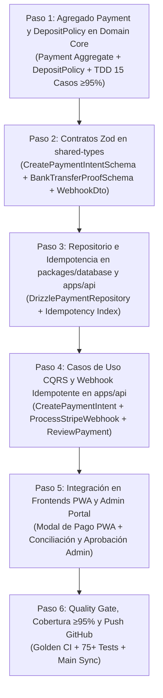

# 📐 Plan de Implementación Quirúrgica: Fase 4 — Motor de Pagos & Liquidación

> **Organización:** [ALR COMPANY](https://github.com/ALR1730) — División de Ingeniería de Software  
> **Líder de Proyecto & Founder:** [Angel Luis Rosario](https://github.com/ALR1730)  
> **Mentor Académico:** Ing. Leonardo (Base Formativa C#, .NET 9, Clean Architecture, Onion Architecture)  
> **Versión:** 4.0.0 — Edición "Turing-Grade"  
> **Estándar:** Clean Architecture · Domain-Driven Design (DDD) · TDD (≥95% Cobertura) · Dual-Stack Architecture

---

## 🎯 Objetivo de la Fase 4

Implementar con rigor contable e idempotencia absoluta el **motor de transacciones financieras, anticipos y liquidaciones de MITEFREE**:

1. Crear el **Agregado de Dominio `Payment`** y el **Servicio de Dominio `DepositPolicy`** en `packages/domain-core` con precisión de tipo `Money`, control de anticipos del 30% y validación de llaves de idempotencia.
2. Desarrollar el adaptador de pagos para **Stripe (`PaymentGatewayAdapter`)** y el flujo de comprobantes de **Transferencia Bancaria Manual**.
3. Implementar el manejador de **Webhooks Idempotentes (`ProcessStripeWebhookUseCase`)** con verificación de firma HMAC y protección irrompible contra doble cobro o eventos duplicados (`uq_idempotency_key`).
4. Diseñar el flujo de **Conciliación y Aprobación Administrativa** en el panel de finanzas (`apps/admin-portal/pagos`).
5. Conectar el cliente móvil **PWA (`apps/pwa-client`)** para pagar el anticipo del 30% con tarjeta o subir comprobante de depósito popular/BHD/Banreservas.
6. Cobertura de pruebas unitarias e integración: **≥ 95%** en idempotencia y políticas de cobro.

---

## 🗺️ Matriz de Ejecución de la Fase 4

---

## 📋 Detalle Quirúrgico de Cada Paso

### 🔹 Paso 1: Agregado `Payment` y `DepositPolicy` en `packages/domain-core`
- **Entidad:** `Payment` en `packages/domain-core/src/entities/payment.entity.ts`.
  - Propiedades: `id`, `appointmentId`, `amount: Money`, `type: PaymentType`, `method: PaymentMethod`, `status: PaymentStatus`, `idempotencyKey: string`, `externalReference?: string`.
  - Transiciones de Estado: `Pending → Completed`, `Pending → UnderReview → Completed / Failed`.
- **Domain Service:** `DepositPolicy` en `packages/domain-core/src/engines/deposit-policy.engine.ts`.
  - Valida que el anticipo cubra exactamente el 30% del total de la cotización (`minDeposit = quoteTotal * 0.30`).
  - Previene doble cobro si el saldo ya ha sido pagado.

### 🔹 Paso 2: Contratos de Transferencia y Schemas Zod en `packages/shared-types`
- `CreatePaymentIntentRequestSchema`, `PaymentIntentResponseSchema`.
- `SubmitBankTransferProofSchema`, `ReviewPaymentSchema`.
- `StripeWebhookPayloadSchema`.

### 🔹 Paso 3: Persistencia Relacional y Repositorio en `apps/api`
- `DrizzlePaymentRepository` en `apps/api/src/infrastructure/repositories/drizzle-payment.repository.ts`.
- Búsqueda por `idempotencyKey`, por `appointmentId` y actualización atómica.

### 🔹 Paso 4: Casos de Uso CQRS y Endpoints en `apps/api`
- `CreatePaymentIntentUseCase`
- `SubmitBankTransferProofUseCase`
- `ProcessStripeWebhookUseCase` (Verifica firma e idempotencia; confirma automáticamente `Appointment`)
- `ReviewPaymentUseCase` (Aprobación/rechazo manual en panel Admin)
- Endpoints en `PaymentsController` y `WebhooksController`.

### 🔹 Paso 5: Frontends PWA y Admin Portal
- **PWA:** Pantalla/modal de liquidación de anticipo con opciones de tarjeta (Stripe) y transferencia bancaria.
- **Admin Portal (`apps/admin-portal/pagos`):** Tabla interactiva de cobros con conciliación de comprobantes y aprobación en 1 clic.

### 🔹 Paso 6: Quality Gate & Push GitHub
- `bun run type-check`, `bun run test`, `bun run build`, push a `main`.
