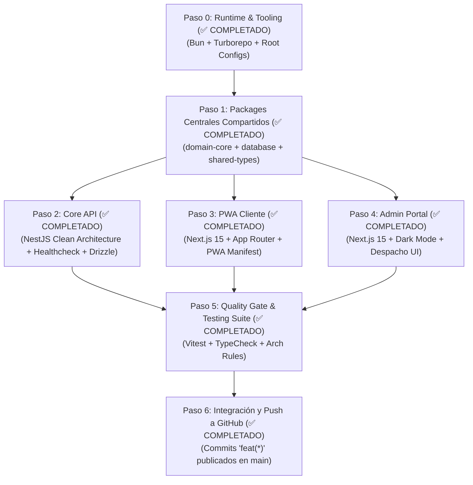

# 🏗️ Plan de Implementación Quirúrgica: Esqueleto del Proyecto MITEFREE

> **Organización:** [ALR COMPANY](https://github.com/ALR1730) — División de Ingeniería de Software  
> **Líder de Proyecto & Founder:** [Angel Luis Rosario](https://github.com/ALR1730)  
> **Mentor Académico:** Ing. Leonardo  
> **Versión:** 1.0.0 — Edición "Turing-Grade"  
> **Estándar:** Clean Architecture · DDD · Turborepo Monorepo · Dual-Stack Architecture

---

## 🎯 Objetivo de la Fase

Construir el **esqueleto base (scaffolding industrial)** de la solución MITEFREE con cero deuda técnica, dejando listo un entorno reproducible, compilable y con las fronteras de capas blindadas antes de escribir la lógica de negocio profunda.

---

## 📐 Matriz de Ejecución por Pasos (100% Completada)



---

## 📋 Detalle Quirúrgico de Cada Paso

### 🔹 Paso 0: Tooling y Configuración Raíz del Monorepo

- **Propósito:** Orquestar el espacio de trabajo monorepo para que múltiples aplicaciones y paquetes compartan dependencias, tipos y caché distribuido.
- **Archivos a crear:**
  - `package.json` (Root con workspaces: `apps/*`, `packages/*`).
  - `turbo.json` (Configuración de pipelines: `build`, `dev`, `lint`, `test`, `type-check`, `db:generate`, `db:migrate`).
  - `tsconfig.base.json` (Configuración estricta de TypeScript 5+: `strict: true`, `noImplicitAny: true`, paths aliases `@mitefree/*`).
  - `.editorconfig` y `.prettierrc` (Garantizar consistencia de estilo y saltos de línea LF).

---

### 🔹 Paso 1: Paquetes Compartidos (`packages/`)

Siguiendo la **Regla de Dependencia Absoluta**, estos paquetes son la base sobre la cual se construye todo el software:

1. **`packages/domain-core` (El Núcleo Sagrado):**
   - Cero dependencias externas (solo TypeScript puro y tipado inmutable).
   - **Value Objects:** `Money` (Amount, Currency), `GeoCoordinate` (Lat, Lng, ZoneCode), `PhoneNumber`, `EmailAddress`.
   - **Enums:** `AppointmentStatus`, `FabricType`, `StainSeverity`, `PaymentType`, `WalletTransactionType`.
   - **Entities Base:** `Quotation`, `Appointment`, `Wallet`, `User`.
   - **Interfaces de Repositorio:** `IQuotationRepository`, `IAppointmentRepository`, `IWalletRepository`.
   - _Equivalencia .NET:_ `Mitefree.Core.Domain` de su repositorio [RealEstateApp](https://github.com/ALR1730/RealEstateApp).

2. **`packages/shared-types` (Contratos de Transferencia):**
   - Schemas de validación en runtime con **Zod**.
   - DTOs de entrada y salida para la API y los clientes frontend.
   - RFC 7807 `ProblemDetails` interfaces.

3. **`packages/database` (Persistencia Drizzle ORM):**
   - Configuración de conexión para **Neon PostgreSQL 16+**.
   - Esquemas declarativos de tablas organizados por bounded context:
     - `schema/identity.ts` (`users`, `technician_profiles`, `addresses`)
     - `schema/catalog.ts` (`furniture_types`, `fabric_factors`, `stain_surcharges`)
     - `schema/quotations.ts` (`quotations`, `quotation_items`, `quotation_photos`)
     - `schema/appointments.ts` (`appointments`, `time_slots`, `routes`)
     - `schema/payments.ts` (`payments`, `invoices`, `webhook_events`)
     - `schema/wallets.ts` (`wallets`, `wallet_transactions`)
   - `drizzle.config.ts` para migraciones automáticas.
   - _Equivalencia .NET:_ `Mitefree.Infrastructure.Persistence` (DbSets y Fluent API).

---

### 🔹 Paso 2: Core Backend API (`apps/api`)

- **Tecnología:** NestJS 11+ estructurado bajo **Clean Architecture en capas**:
  - `src/presentation/`:
    - `controllers/`: `HealthController`, `QuotationsController`, `AppointmentsController`, `WalletsController`.
    - `filters/`: `HttpExceptionFilter` (RFC 7807 ProblemDetails).
    - `pipes/`: `ZodValidationPipe` (Validación automática de DTOs en el boundary HTTP).
    - `main.ts`: Composición raíz, CORS, prefijo global `/api/v1`, OpenAPI Scalar Docs en `/api/docs`.
  - `src/application/`:
    - Use Cases orquestados mediante handlers independientes.
    - Pattern `Result<T, E>` para manejo de errores de dominio sin lanzar excepciones.
  - `src/infrastructure/`:
    - Adaptadores de repositorios implementando las interfaces de `domain-core` usando Drizzle ORM.
    - Stubs / Adaptadores iniciales de storage, payments y notificaciones.
- _Equivalencia .NET:_ `Mitefree.Presentation.WebAPI` + `Mitefree.Core.Application`.

---

### 🔹 Paso 3: Cliente PWA (`apps/pwa-client`)

- **Tecnología:** Next.js 15 (App Router + React Server Components).
- **Enfoque:** Experiencia móvil de máxima fidelidad (PWA offline-ready).
- **Rutas clave iniciales:**
  - `/` (Landing page institucional y acceso rápido a cotizar).
  - `/cotizar` (Flujo guiado de cotización en 3 pasos).
  - `/agenda` (Selección visual de bloques de tiempo y zonas).
  - `/wallet` (Consulta de cashback y programa de referidos).
  - `/mis-citas` (Seguimiento del técnico en vivo y aprobación de servicio).
- **PWA Asset:** `public/manifest.json` y service worker básico.

---

### 🔹 Paso 4: Panel Operativo & Técnicos (`apps/admin-portal`)

- **Tecnología:** Next.js 15 + Tailwind CSS + Modo Oscuro / Claro.
- **Propósito:** Gestión operativa interna de ALR COMPANY (despacho, finanzas, métricas).
- **Vistas clave iniciales:**
  - `/dashboard` (Métricas de conversión, ingresos diarios, volumen de cotizaciones).
  - `/citas` (Tablero Kanban y calendario de asignación de cuadrillas técnicas).
  - `/tecnicos` (Control de técnicos activos, rutas asignadas y comisiones).
  - `/pagos` (Revisión y conciliación de transferencias bancarias y comprobantes).
  - `/configuracion` (Matriz de precios base, recargos de telas y porcentajes de cashback).

---

### 🔹 Paso 5: Suite de Pruebas y Quality Gate

- **Vitest:**
  - Configuración multirunner ultrarrápida.
  - Primer suite de pruebas unitarias:
    - `packages/domain-core`: Validación de invariantes de `Money`, transiciones de `AppointmentStatus` y cálculo del ledger de `Wallet`.
- **NetArch / ArchUnit-TS:**
  - Test automatizado que verifica que `domain-core` jamás importe `infrastructure` o `api`.

---

### 🔹 Paso 6: Compilación, Verificación y Push a GitHub

1. Ejecución de `turbo run build` para asegurar que todas las aplicaciones y paquetes compilan sin warnings ni errores.
2. Comprobación de tipos con `turbo run type-check`.
3. Verificación de `git status` y creación del commit formal:
   ```bash
   git commit -m "feat(core): scaffold Turborepo monorepo with Bun, NestJS API, Next.js 15 PWA and shared domain packages"
   git push origin main
   ```

---

## ⏱️ Estimación de Ejecución

- **Fase A (Tooling + Shared Packages):** ~15 minutos.
- **Fase B (Core API Scaffolding):** ~15 minutos.
- **Fase C (PWA Client & Admin Portal Scaffolding):** ~20 minutos.
- **Fase D (Testing & Quality Gate Validation):** ~10 minutos.
- **Total:** Ejecución fluida, modular y completamente verificada.
