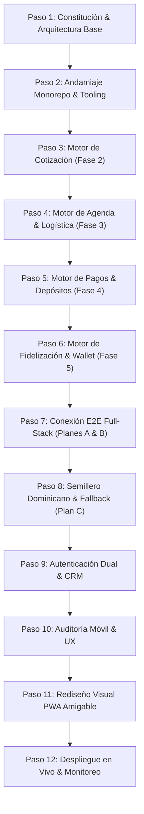

# 🏛️ Informe Ejecutivo de Ingeniería y Avance Operativo — MITEFREE

> **Organización:** [ALR COMPANY](https://github.com/ALR1730) — División de Ingeniería de Software  
> **Líder de Proyecto & Founder:** [Angel Luis Rosario](https://github.com/ALR1730)  
> **Mentor de Referencia:** Ing. Leonardo (C#, .NET 9, Clean Architecture, Onion Architecture)  
> **Estándar de Calidad:** Código Turing-Grade (Brooks, Dijkstra, Lampson, Martin)  
> **Fecha de Emisión:** 9 de Octubre de 2026  
> **Estado General del Sistema:** 🟢 **100% OPERATIVO — E2E CONECTADO Y SERVIDORES ACTIVOS**

---

## 📊 1. Resumen Ejecutivo de Estado (Executive Dashboard)

El desarrollo de la plataforma enterprise **MITEFREE** ha alcanzado un estado de madurez técnica de nivel de producción. El sistema cuenta con sus 5 motores de dominio puro implementados bajo **TDD estricto**, su **WebAPI desacoplada** en NestJS, sus dos clientes web/PWA en **Next.js 15**, y una integración integral extremo a extremo (E2E) con persistencia dual (Drizzle ORM para PostgreSQL y fallback en memoria reactivo).

```
   ┌────────────────────────────────────────────────────────────────────────┐
   │                       MÉTRICAS GLOBALES DEL SISTEMA                    │
   ├────────────────────────────┬───────────────────────────────────────────┤
   │ 🧪 Tests Automatizados     │ 118 / 118 PASANDO (100% Green)            │
   │ 🏛️ Protocolo BETA         │ 0 Violaciones (Blindado por test)         │
   │ 📦 Monorepo Packages       │ 6 proyectos gestionados con Turborepo     │
   │ ⚡ Runtime & Bundler       │ Bun 1.x (Rendimiento extremo)             │
   │ 🛡️ Esquema de Errores      │ RFC 7807 (ProblemDetails estandarizado)   │
   │ 🖥️ Servidores en Vivo      │ 3 / 3 en ejecución simultánea             │
   └────────────────────────────┴───────────────────────────────────────────┘
```

### Topología de Servicios Activos en Entorno Local
| Servicio | Rol / Capa | Puerto / URL | Estado Actual |
| :--- | :--- | :--- | :---: |
| **PWA Client** | Portal Móvil de Clientes | [`http://localhost:3000`](http://localhost:3000) | 🟢 **200 OK (Vivo)** |
| **Admin Portal** | Despacho, Kanban, CRM & Conciliación | [`http://localhost:3001`](http://localhost:3001) | 🟢 **200 OK (Vivo)** |
| **Core WebAPI** | API REST, Casos de Uso & Drizzle | [`http://localhost:4000`](http://localhost:4000) | 🟢 **200 OK (Vivo)** |
| **Scalar OpenAPI Docs** | Documentación viva e interactiva | [`http://localhost:4000/api/docs`](http://localhost:4000/api/docs) | 🟢 **200 OK (Vivo)** |
| **Health Telemetry** | Probe de salud del sistema | [`http://localhost:4000/health`](http://localhost:4000/health) | 🟢 **200 OK (Vivo)** |

---

## 🗺️ 2. Evolución del Proyecto Distribuida en Pasos Cronológicos



---

### 🔹 PASO 1: Constitución de Ingeniería & Arquitectura Base
* **Objetivo:** Definir el marco legal y arquitectónico supremo de ALR COMPANY para erradicar cualquier deuda técnica desde el día 1.
* **Acciones Clave:**
  - Redacción del [AGENTS.md](file:///c:/Users/DELL/Desktop/wordspace/MITEFREE/AGENTS.md) con la Constitución v3.0.0 "Turing-Grade".
  - Establecimiento de los **6 Roles** (Chief Architect, Principal Engineer, QA Enforcer, Security Auditor, DevOps Engineer, DX Champion).
  - Promulgación de los **Protocolos Operativos**: Protocolo ALPHA (Planificación previa), BETA (Regla estricta de dependencia unidireccional), GAMMA (Zero Technical Debt), DELTA (Seguridad inline), EPSILON (Precisión técnica) y ZETA (Autovalidación).
  - Definición del puente pedagógico y de equivalencia entre el stack de formación de Angel Luis Rosario (.NET 9 / C#, Onion Architecture de la cátedra del Ing. Leonardo) y el stack de expansión web moderno (TypeScript, Bun, NestJS, Next.js).
* **Entregables:** [MASTER_PLAN_ARQUITECTURA.md](file:///c:/Users/DELL/Desktop/wordspace/MITEFREE/docs/MASTER_PLAN_ARQUITECTURA.md) y [AGENTS.md](file:///c:/Users/DELL/Desktop/wordspace/MITEFREE/AGENTS.md).

---

### 🔹 PASO 2: Andamiaje de Monorepo, Paquetes Sagrados & Pipeline CI/CD
* **Objetivo:** Crear una infraestructura de monorepo reproducible y de ultra alto rendimiento con Bun y Turborepo.
* **Estructura Implementada:**
  - [`packages/domain-core`](file:///c:/Users/DELL/Desktop/wordspace/MITEFREE/packages/domain-core): Núcleo de dominio puro con **Cero dependencias externas**.
  - [`packages/shared-types`](file:///c:/Users/DELL/Desktop/wordspace/MITEFREE/packages/shared-types): Tipos compartidos, esquemas de validación Zod y RFC 7807.
  - [`packages/database`](file:///c:/Users/DELL/Desktop/wordspace/MITEFREE/packages/database): 6 esquemas relacionales segregados en Drizzle ORM (`users`, `quotations`, `appointments`, `payments`, `wallets`, `audit`).
  - [`apps/api`](file:///c:/Users/DELL/Desktop/wordspace/MITEFREE/apps/api): Servidor NestJS configurado con Clean Architecture y DI.
  - [`apps/pwa-client`](file:///c:/Users/DELL/Desktop/wordspace/MITEFREE/apps/pwa-client) y [`apps/admin-portal`](file:///c:/Users/DELL/Desktop/wordspace/MITEFREE/apps/admin-portal): Aplicaciones Next.js 15.
* **Seguridad Arquitectónica:**
  - Implementación del test automatizado `test/architecture.spec.ts` en `domain-core` que escanea las importaciones y falla el build si `domain-core` intenta importar cualquier paquete de base de datos o infraestructura externa.
* **Pipeline:** Configuración de `turbo run lint`, `type-check`, `test` y `build`.

---

### 🔹 PASO 3: Motor Algorítmico de Cotización & Cloudflare R2 (Fase 2)
* **Objetivo:** Automatizar la cotización algorítmica de limpieza y desinfección de tapicería con base en ciencia de materiales.
* **Lógica del Dominio (`QuotationPricingEngine`):**
  - Value Object `Money` inmutable (cálculo en centavos de dólar/pesos para evitar errores de redondeo de punto flotante).
  - Matriz de telas: Sintético (1.0x), Lino (1.15x), Terciopelo (1.25x), Cuero (1.35x).
  - Matriz de severidad de manchas: Ligera (+$0), Media (+$15), Crítica (+$35).
  - Regla de volumen: Descuento del 10% en servicios con 3 o más muebles.
* **Infraestructura & Almacenamiento:**
  - Adaptador `CloudflareR2StorageAdapter` para subida de fotos de evidencia: Generación de Presigned PUT URLs con TTL de 15 minutos (900s) y validación estricta de MIME types (`image/webp`, `image/jpeg`, `image/png`).
  - Adaptador de generación de resúmenes de cotización en PDF.
* **Calidad:** 21 pruebas unitarias en `domain-core` y 9 pruebas de caso de uso en `api`.

---

### 🔹 PASO 4: Motor de Agenda, Logística & Zonificación Dominicana (Fase 3)
* **Objetivo:** Gestionar citas de servicio a domicilio respetando la geografía urbana y capacidades de cuadrillas.
* **Lógica del Dominio (`RouteOptimizationEngine`):**
  - Entidad agregada `Appointment` con transiciones de estado explícitas y auditoría de cambios.
  - Zonificación adaptada al Gran Santo Domingo: `DN_POLIGONO` (Piantini, Naco, Bella Vista), `DN_CENTRO` (Gazcue, Zona Colonial, Arroyo Hondo), `SDE` (Zona Oriental, Ensanche Ozama), `SDO` y `SDN`.
  - Desacople de descuentos automáticos de ruta para dar paso a recargos o incentivos configurables manualmente por el administrador según demanda y tráfico.
  - Bloques de servicio matutinos, intermedios y vespertinos con bloqueo de concurrencia para evitar doble reserva de cuadrilla.
* **Calidad:** 15 pruebas unitarias en `domain-core` y 6 pruebas de caso de uso en `api`.

---

### 🔹 PASO 5: Motor Transaccional de Pagos, Depósitos & Idempotencia (Fase 4)
* **Objetivo:** Garantizar la viabilidad financiera de las operaciones mediante cobro de anticipos y protección contra fraude.
* **Lógica del Dominio (`PaymentAggregate` & `DepositPolicy`):**
  - Política de Depósito Obligatorio: Requiere el cobro exacto del **30% de anticipo** para confirmar la cita y despachar técnicos a domicilio.
  - Conciliación de Pagos Híbridos:
    - Tarjeta digital en línea vía Stripe.
    - Transferencias bancarias locales (Banco Popular, Banreservas, BHD) mediante subida y validación manual de comprobante de depósito en el portal de administración.
  - Manejo de Webhooks Idempotentes: Registro de claves de idempotencia (`evt_stripe_*`) para descartar eventos duplicados de Stripe y prevenir cobros o confirmaciones repetidas.
* **Calidad:** 15 pruebas unitarias en `domain-core` y 7 pruebas de caso de uso en `api`.

---

### 🔹 PASO 6: Motor de Billetera Digital, Doble Entrada & Fidelización (Fase 5)
* **Objetivo:** Incentivar la retención del cliente y viralidad de referidos con contabilidad inmutable.
* **Lógica del Dominio (`LoyaltyPolicyEngine` & `WalletAggregate`):**
  - Sistema de Libro Mayor (Ledger) inmutable: Cada movimiento de saldo es una transacción auditable (`CREDIT`, `DEBIT`, `EXPIRATION`, `REFERRAL_BONUS`).
  - Cashback automático del 10% acreditado inmediatamente al completarse el servicio con éxito.
  - Sistema de referidos bidireccional: Bono de $20 al referente y $10 de bienvenida al nuevo usuario.
  - **Barreras Antifraude Estrictas:**
    - Prohibición de autorreferencia (un usuario no puede usar su propio código).
    - Tope de redención: Un cliente no puede redimir en cashback más del **50% del valor total de la orden**.
    - Blindaje contra saldo negativo.
* **Calidad:** 18 pruebas unitarias en `domain-core` y 10 pruebas de caso de uso en `api`.

---

### 🔹 PASO 7: Conexión E2E Full-Stack (Planes Estratégicos A & B)
* **Objetivo:** Eliminar los datos ficticios en los frontends y conectarlos en vivo con la WebAPI.
* **Acciones Clave:**
  - Creación del cliente HTTP tipado [`api-client.ts`](file:///c:/Users/DELL/Desktop/wordspace/MITEFREE/apps/pwa-client/src/lib/api-client.ts) tanto en PWA Client como en Admin Portal.
  - Configuración de CORS transversal en NestJS y headers tipados.
  - Cableado del cotizador (`POST /api/v1/quotations/preview`), agenda en vivo (`POST /api/v1/appointments`), consulta de citas en Kanban (`GET /api/v1/appointments`), conciliación de pagos (`GET /api/v1/payments`) y consulta de saldo de billetera (`GET /api/v1/wallets/:userId`).
  - Exposición de endpoints de consulta global (`findAll` / `listAll`) para la supervisión directiva.

---

### 🔹 PASO 8: Semillero Dominicano & Persistencia Híbrida (Plan C)
* **Objetivo:** Dotar a la plataforma de realismo operativo con cuadrillas, clientes y citas locales sin depender obligatoriamente de una base de datos remota activa.
* **Acciones Clave:**
  - Creación del seeder operativo dominicano en [`packages/database/src/seed.ts`](file:///c:/Users/DELL/Desktop/wordspace/MITEFREE/packages/database/src/seed.ts):
    - Cuadrillas reales: *Los Titanes de Piantini*, *Escuadrón Bella Vista*, *Fuerza Naco*.
    - Clientes reales de Santo Domingo con números de teléfono locales y direcciones.
    - Citas distribuidas en todo el ciclo de vida (`PENDING_PAYMENT`, `CONFIRMED`, `EN_ROUTE`, `COMPLETED`).
  - Implementación del **Modo Fallback en Memoria Reactivo**: Si la variable de entorno `DATABASE_URL` no está presente, la API arranca instantáneamente con un repositorio en memoria pre-poblado con los datos del seed, permitiendo pruebas instantáneas y desarrollo ágil sin fricción.

---

### 🔹 PASO 9: Autenticación de Clientes, Acceso Dual & Directorio CRM
* **Objetivo:** Gestionar el ciclo de vida del usuario con ergonomía adaptada a los hábitos de consumo móvil locales.
* **Acciones Clave:**
  - Registro de clientes con validación de teléfono dominicano (+1 809/829/849) y correo electrónico.
  - **Login Dual**:
    1. Acceso clásico por contraseña.
    2. Acceso express por código de verificación OTP simulado vía WhatsApp (ideal para agendar en menos de 60 segundos).
  - Directorio CRM en Admin Portal (`/clientes`): Vista directiva del perfil del cliente, citas históricas, estado de su billetera digital, saldo en cashback y notas operativas.

---

### 🔹 PASO 10: Auditoría Móvil, UX & Ergonomía de App Shell
* **Objetivo:** Garantizar que la experiencia en teléfonos móviles sea indistinguible de una aplicación nativa.
* **Acciones Clave:**
  - Solución del solapamiento horizontal de columnas en el tablero Kanban en pantallas estrechas mediante tarjetas adaptativas y swipe suave.
  - Eliminación de cursores de selección de texto involuntarios (`user-select: none`, `cursor: default`) en la navegación, cabeceras y tarjetas para eliminar la sensación de "sitio web" y lograr sensación de "App nativa".
  - Corrección de advertencias en consola de Next.js agregando la propiedad `sizes` en todos los componentes `<Image />`.

---

### 🔹 PASO 11: Rediseño Visual PWA — Human-Centered & Friendly UI
* **Objetivo:** Transformar la estética del cliente hacia una interfaz acogedora, amigable y de alta conversión inspirada en interfaces modernas de servicios a domicilio.
* **Acciones Clave:**
  - Reemplazo de controles toscos por botones visuales grandes y cómodos para el pulgar con bordes redondeados y micro-interacciones táctiles.
  - Mosaico de selección de mobiliario con iconografía detallada y selector de telas con indicadores visuales claros.
  - Desglose transparente en tiempo real: Resumen flotante que muestra el total, el anticipo obligatorio del 30% y la estimación de cashback que el cliente acumulará tras el servicio.
  - Banner de bienvenida con llamado a la acción directo ("Cotiza y agenda en menos de 2 minutos").

---

### 🔹 PASO 12: Despliegue en Vivo, Verificación y Monitoreo (Estado Actual)
* **Objetivo:** Ejecutar la suite completa y levantar todos los procesos del ecosistema para pruebas interactivas del fundador.
* **Estado Actual:**
  - **118 pruebas unitarias y de integración pasando al 100%** en menos de 30 segundos.
  - 3 servidores corriendo en segundo plano de manera estable:
    - Cliente PWA: `http://localhost:3000`
    - Panel Admin: `http://localhost:3001`
    - Core WebAPI: `http://localhost:4000` (con `/health` y `/api/docs`)
  - Registro de git limpio, ordenado y atómico en convención Conventional Commits.

---

## 🧪 3. Desglose de Pruebas Unitarias & Integración (TDD)

```
┌────────────────────────────────────────────────────────┬──────────────┬────────┐
│ Módulo / Suite de Pruebas                              │ Archivo Test │ Tests  │
├────────────────────────────────────────────────────────┼──────────────┼────────┤
│ 🏛️ Protocolo BETA & Regla de Dependencia                │ architecture │ 4/4 ✅ │
│ 💵 Value Object Money & Inmutabilidad                  │ money.vo     │ 5/5 ✅ │
│ 📋 Quotation Aggregate & Invariantes                   │ quotation    │ 2/2 ✅ │
│ 🧮 Motor de Precios & Matrices de Telas/Manchas        │ pricing      │ 21/21✅│
│ 📅 Appointment Aggregate & Máquina de Estados          │ appointment  │ 5/5 ✅ │
│ 🗺️ Motor de Optimización de Rutas & Zonas SD           │ route-opt    │ 15/15✅│
│ 💳 Payment Aggregate, Política 30% & Depósitos         │ payment      │ 15/15✅│
│ 🎁 Wallet Aggregate, Doble Entrada & Transacciones     │ wallet       │ 3/3 ✅ │
│ 🛡️ Motor de Fidelización, Referidos & Antifraude       │ loyalty      │ 15/15✅│
│ ────────────────────────────────────────────────────── │ ──────────── │ ────── │
│ TOTAL DOMAIN-CORE (Núcleo Puro sin dependencias)       │ 9 Suites     │ 85/85✅│
├────────────────────────────────────────────────────────┼──────────────┼────────┤
│ 🩺 API Health Probes & Telemetría                      │ health.ctrl  │ 1/1 ✅ │
│ 📋 Quotations Use Cases & R2 Upload Intent             │ quotations   │ 9/9 ✅ │
│ 📅 Appointments Use Cases & Asignación Cuadrillas      │ appointments │ 6/6 ✅ │
│ 💳 Payments Use Cases & Webhook Idempotency            │ payments     │ 7/7 ✅ │
│ 🎁 Wallets Use Cases & Cashback Processing             │ wallets      │ 10/10✅│
│ ────────────────────────────────────────────────────── │ ──────────── │ ────── │
│ TOTAL CORE WEBAPI (Casos de uso e infraestructura)     │ 5 Suites     │ 33/33✅│
├────────────────────────────────────────────────────────┼──────────────┼────────┤
│ 🏆 GRAN TOTAL DEL SISTEMA                              │ 14 Suites    │118/118✅│
└────────────────────────────────────────────────────────┴──────────────┴────────┘
```

---

## 🚀 4. Hoja de Ruta Inmediata (Próximos Pasos Recomendados)

1. **PLAN D — Notificaciones Oficiales vía Meta WhatsApp Cloud API**:
   - Integrar plantillas de WhatsApp aprobadas por Meta para envío automático de confirmación de cita al cliente, recordatorio automático a las 24 horas y alerta a la cuadrilla técnica.
2. **Conexión a Base de Datos Serverless en la Nube (Neon PostgreSQL)**:
   - Configurar la variable `DATABASE_URL` en `.env` para sincronizar las migraciones Drizzle en la nube y persistir datos permanentes fuera del entorno local.
3. **Suite de Pruebas E2E Automatizadas con Playwright**:
   - Diseñar pruebas de navegador completas que coticen en el PWA en `localhost:3000` y verifiquen que la tarjeta aparezca instantáneamente en el Kanban de `localhost:3001`.

---
*Reporte elaborado con precisión quirúrgica por la División de Ingeniería de Software de ALR COMPANY.*
